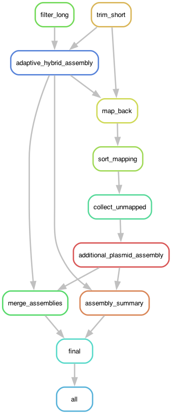
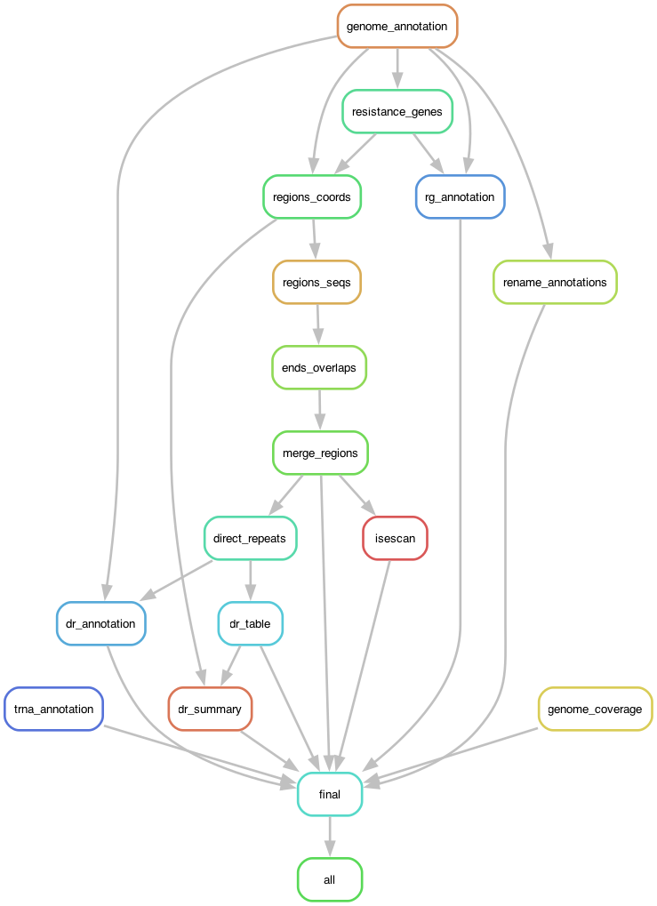
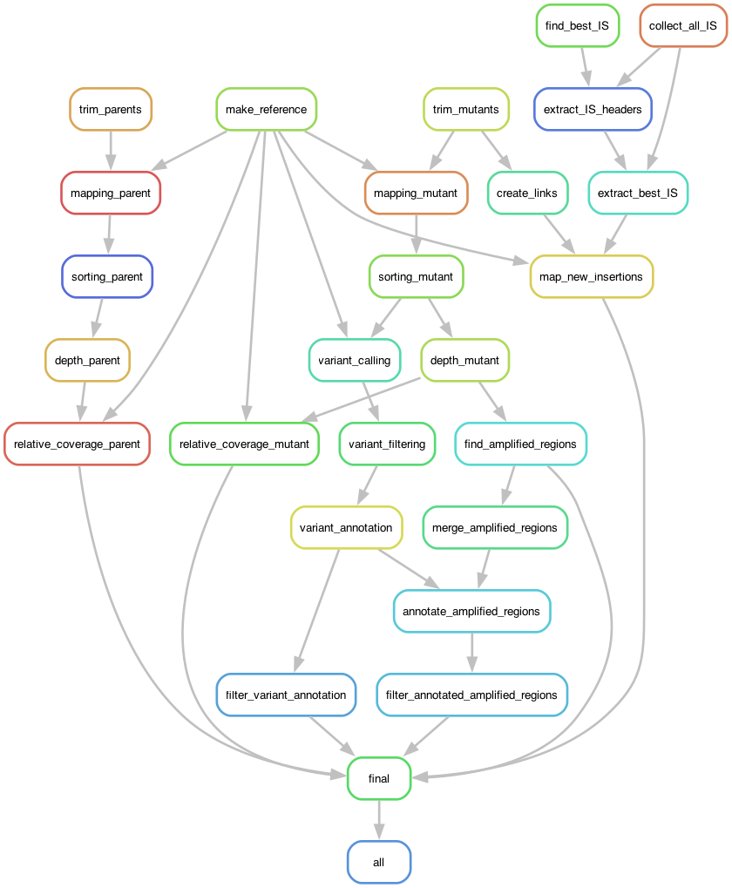
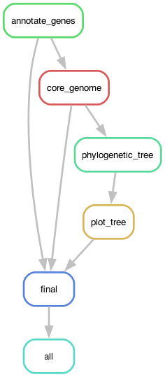

[](https://snakemake.bitbucket.io)     


# Machine learning detection of unstable antibiotic heteroresistance in *E. coli*

This project contains 4 workflows:

- (1) to run hybrid assembly of genomes using both long and short sequencing reads;

- (2) to run annotation of resistance genes, direct repeats and IS elements;

- (3) to run genetic analysis of heteroresistant mutants;

- (4) to run core-genome based phylogeny.

And several R notebooks to do machine learning, EDA and model comparison.

## How to run the workflows

### Prerequisites

Snakemake workflow management system is required to run the workflows. Refer to the [official documentation](https://snakemake.readthedocs.io/en/stable/getting_started/installation.html) for installation instructions.
The safest way to reproduce the results is to run the analysis inside containers. To build the required Singularuty/Apptainer containers [read this](workflow/docker/README.md). If you opt to not use containers, Snakemake will install and deploy all required software automatically using [Mamba](https://mamba.readthedocs.io/en/latest/index.html).

To download the code to your computer, clone the repository:

```bash
git clone https://github.com/andrewgull/HeteroR
```

Then navigate to the `HeteroR` directory (in the following steps, we will assume that you are inside this directory).

### Data

1. The sequencing reads used for this project are deposited in [NCBI SRA](https://www.ncbi.nlm.nih.gov/sra?db=sra) database under project number **PRJNA1165464**.
Important naming convention: long reads have `.fastq.gz` extension and paired short reads have `.fq.gz`extension.
By default reads downloaded from SRA have names like "SRR followed by 8 digits", this project assumes theat all the read files are named after the in-house naming scheme which is "DA followed by 6 digits".
To determine how the SRR numbers correspond to DA numbers, refer to the table in SRA Run Selector or to `configs/da_srr_mapping.csv`.
The sequencing data can be placed anywhere on your computer.

2. One more piece of data you need is [CARD database](https://card.mcmaster.ca/). You can use the version *we used* for this project which is in `localDB.tgz` archive. Just unpack it and make sure it's inside the project's directory, i.e. inside `HeteroR`:

```bash
tar -xf localDB.tgz
```

Alternatively, you can download the newest version of the database from the CARD website:

```bash
wget https://card.mcmaster.ca/latest/data
```

If you choose to do so, the final results of the analysis might look a little different.

### Running the workflows
Once you have installed snakemake and downloaded the data (and built the containers), you can run the workflows.

Execution of the workflows is governed by the configuration files in the `configs` directory. The main `config.yaml` defines which workflow to run and where to find the container files.


To run the assembly pipeline, use this command:

```bash
snakemake --config run_assembly=True --use-apptainer --apptainer-args "--bind /path/to/data" --cores 10
```

Then you can run the annotation pipeline:

```bash
snakemake --config run_annotation=True --use-apptainer --apptainer-args "--bind /path/to/data" --cores 10
``` 

Alternatively, you can use the apptainer profile config file `profiles/apptainer/config.yaml` to avoid typing apptainer args every time:

```bash
snakemake --config run_annotation=True --profile profiles/apptainer
```

After these pipelines have finished, you can run the three R notebooks (but not necessarily all of them):

1. to generate features table: `notebooks/modelling/features.qmd` (also, a pre-compiled table is available here `notebooks/modelling/data/features_strain.csv`)
2. for exploratory data anlysis: `notebooks/modelling/EDA.qmd` (pre-compiled HTML file is available here `notebooks/modelling/EDA.html.gz`)
3. to run training and validation:`notebooks/modelling/training_and_validation.Rmd` (pre-compiled HTML file is available here `notebooks/modelling/training_and_validation.html.gz`)
4. for comparison and analysis of the models: `notebooks/modelling/models_analysis.Rmd` (pre-compiled HTML file is available here `notebooks/modelling/models_analysis.html.gz`)

To ensure that you use the same versions of R packages as were used in these notebooks, install *renv* package and run `renv::restore()` ([here](https://rstudio.github.io/renv/index.html) you can find *renv* documentation).

#### Mutants and phylogenetic analysis

Overall, the idea is the same - just set the workflow name to `True`(and don't run more than one workflow at a time):

```bash
# mutants
snakemake --config run_mutants=True --profile profiles/apptainer
# phylogeny
snakemake --config run_phylogeny=True --profile profiles/apptainer
```

**NB**: to find NCBI accession numbers of the reference strains used for the phylogenetic analysis, refer to file `configs/strain_mapping/reference_strains.csv`.

## Data availability

The raw sequencing reads used in this project are available from NCBI SRA under BioProjects 

- **PRJNA1165464** (474 parental strains), 
- **PRJNA1083935** and **PRJNA1160527** (mutants).

## Models and features table

The pre-compiled features table is available under `notebooks/modelling/data/features_strain.csv`

The final models (trained LLR and GBT) are available under `notebooks/modelling/models`.

## Rule graphs

1. Assembly



2. Annotation



3. Mutants



4. Phylogeny



**Read this in case the assembly script crashes due to system library problems**

(1) Hybrid assembly script will not work if your system doesn't have *libgsl.so.25* and *libcblas.so.3* (both required by bcftools which is required by medaka=1.6.0).
For some reason, the wrong versions of these libraries are installed by conda when solving the environment. In such case use files in `workflow/libs` - copy or link them to the environment's `lib` directory.

This *should not* be a problem if you use containers.