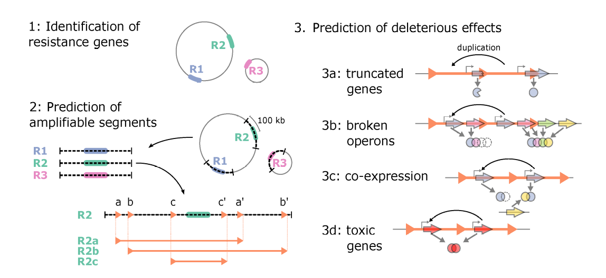
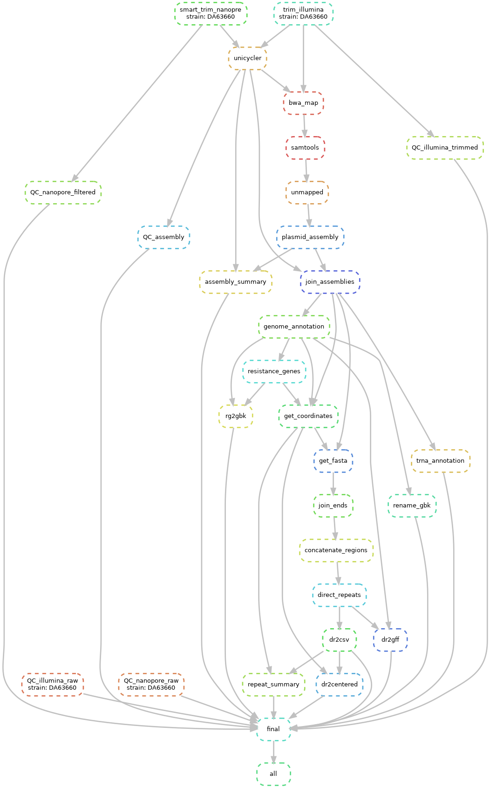

# Sequence based prediciton of Unstable and Gene-amplification Generated Heteroresistance


**Background:** Heteroresistance (HR) is a phenomenon in which a preexisting subpopulation of resistant cells can rapidly replicate in the presence of a given antibiotic, whereas the majority population of susceptible cells is killed. The mechanisms underlying HR are somewhat unclear, although unstable amplification of antibiotic resistance genes resulting in increased gene dosage is responsible for the resistant subpopulation in numerous cases

**Objective:** Predicting heteroresistance from bacterial genome data.

**Input:** 
- Nanopore and Illumina reads;
- "resistance labels"

**Metrics:**



1. Presence of resistance genes (RG)
   - presence of known RG as identified from the CARD database
   - presence of efflux pumps as identified from the CARD database

2. Presence of amplifiable regions
   - For each RG all pairs of direct repeats (DR) flanking the RG. 
     - DR min length = 10 bp, max mismatch = 10%, search range 100 kb. 
     - DR pairs are scored according to their length, their level of identity, and their distance to each other. 
     - These three parameters should reflect the probability that the segment encompassing the RG will be amplified. 

3. Presence of deleterious effects
   - truncated genes (any DR inside a gene?); 
   - broken operons (any DR inside an operon?); operons will be identified via [ODB4](https://operondb.jp/)
   - co-expression as identified by [StringDB](https://string-db.org/) (Are any of the genes in the amplified segment known to be co-expressed with a gene outside of the segment?)
   - toxic essential genes: essential genes (as identified by databases TraDIS (?) and Keio(?)) being truncated may become toxic.
   - toxic if over-expressed: gene amplifications may increase the expression of the gene, which in turn may be toxic. Related data can be found in databases [EDGE](https://www.pnas.org/content/pnas/early/2013/11/05/1312361110), [ASKA](https://academic.oup.com/dnaresearch/article/12/5/291/350187) and [PandaTox](https://exploration.weizmann.ac.il/pandatox/1_0/home.html).

The pipeline is created using [Snakemake](https://snakemake.readthedocs.io/en/stable) - a Python-based workflow management system for reproducible and scalable data analysis. [The "rolling" paper reference](https://f1000research.com/articles/10-33/v2) 

## The project structure

The project home directory is `/home/andrei/Data/HetroR`
 which contains the following directories:

```bash
 $ tree                    
.
├── images
│   ├── dag_full.png
│   ├── heatmap44.png
│   ├── heatmap54.png
│   ├── HR_workflow_features_scheme.png
│   └── unstable_HR_model.png
├── notebooks
│   ├── genome_assembly_summary.rmd
│   ├── repeats_summary.ipynb
│   ├── testing_rgi_output.Rmd
│   ├── testing_rgi_output.Rproj
│   ├── why_unicycler_gets_killed.Rmd
│   └── why_unicycler_gets_killed.Rproj
├── README.md
├── resources
│   ├── busco_downloads
│   ├── data_raw
│   ├── localDB
│   └── strain_lists
├── results
│   ├── annotations
│   ├── assemblies
│   ├── assemblies_joined
│   ├── coverage
│   ├── data_filtered
│   ├── direct_repeats
│   ├── final
│   ├── logs
│   ├── mapping
│   ├── plasmids
│   ├── qualcheck_assembly
│   ├── qualcheck_reads
│   └── resistance_genes
└── workflow
    ├── config.yaml
    ├── envs
    │   ├── bedtools.yaml
    │   ├── busco_quast.yaml
    │   ├── bwa.yaml
    │   ├── fastp.yaml
    │   ├── filtlong.yaml
    │   ├── grf.yaml
    │   ├── prokka.yaml
    │   ├── quast.yaml
    │   ├── rgi.yaml
    │   ├── rscripts.yaml
    │   ├── samtools.yaml
    │   ├── spades.yaml
    │   ├── spade.yaml
    │   ├── trnascan.yaml
    │   └── unicycler.yaml
    ├── scripts
    │   ├── assembly_summary.py
    │   ├── coverage.sh
    │   ├── flanking_regions.py
    │   ├── get_card_db.sh
    │   ├── get_new_strains_list.sh
    │   ├── GRF_parser.py
    │   ├── gr_generator.py
    │   ├── join_two_fastas.py
    │   ├── makefile
    │   ├── map_back.sh
    │   ├── nanopore_qc.py
    │   ├── process_files.py
    │   ├── QC_assembly.py
    │   ├── run_qualcheck.R
    │   ├── run_qualcheck.sh
    │   ├── run_quast.py
    │   └── update_symlinks.py
    └── snakefile


```

### Directories' description

`images/` - workflow DAGs, RGI heatmaps etc.

`resources/` is for storing retrieved/transferred data like: raw_reads, BUSCO downloads, strain lists

   - `data_raw/` - raw sequencing data (both Illumina and Nanopore reads) copied from Argos 
   - `strain_lists/` - lists of available and processed strains, serves as input to some scripts that prepare data for the processing by the pipeline
   - `busco_downloads/` - files required by BUSCO

`results/` is for everything the pipeline produces
  - `data_filtered/` - sequencing data after filtering with filtlong and fastp
  - `direct_repeats/` - direct repeats as detected by GRF
  - `qualcheck_reads/` - quality control data
  - `assemblies/` - hybrid assemblies made with Unicycler
  - `qualcheck_assembly/` - assembly quality control made with BUSCO and QUAST
  - `mapping/` - mapping of short reads onto genome assembly to collect unmapped reads
  - `plasmids/` - assembly of unmapped reads with SPAdes ('plasmid' mode) to assemble plasmids missed by Unicycler
  - `assemblies_joined/` - keeps merged hybrid and plasmid assembly
  - `annotations/` - assembly annotations made with PROKKA and tRNA-ScanSE, GFF files with direct repeats
  - `resistance_genes/` - resistance genes tables identified by RGI (requires local CARD database)
  - `logs/` - tool's logs
  - `coverage/` - a bunch of tables with Nanopore coverage
  - `final/` - "regulatory" dir created by Snakemake, nothing important there
  
`test_dir/` - various test of tools used in the pipeline
  - `tools/` - some tools required for the testing 

`localDB/` - local instance of the CARD database (required by RGI)

`notebooks/` - these are copies of actual notebooks that I keep on GoogleDrive. Hope these copies will be updated regularly

`workflow/` - the pipeline's actual code
 - `snakefile` - a file describing the workflow
 - `envs/` - a set of YAML files describing required conda environments
 - `scripts/` - additional scripts used by Snakemake and by me

`config.yaml` - a list of strains to be processed

## How to run the analysis:

1. mount ARGOS
2. get list of strains on ARGOS `ls /home/andrei/Data/Argos/imb_sal_raw/Sequenced_reference_strains/Sequencing/Strains/ > strains_on_argos.txt`
3. get list of strains to process `bash workflow/scripts/get_new_strains_list.sh strains_on_argos.txt > strains_to_process.txt`
4. run `workflow/scripts/process_files.py -s strains_to_process.txt` to transfer read files from ARGOS, rename them, calculate coverage and create config file.
5. load a local instance of CARD db (it must be in the project dir as 'localDB' - use `rgi load`)
6. run the pipeline using the command `snakemake --use-conda --cores 14 --resources mem_mb=12000`
7. run the following command to produce a nice heatmap of resistance hits in your strains:
   ```
   cd results/resistance_genes; 
   for D in DA*; do ln -s "/home/andrei/Data/HeteroR/results/resistance_genes/"$D"/rgi_table.json" "/home/andrei/Data/HeteroR/results/resistance_genes/linked/"$D"_rgi_table.json"; done && 
   rgi heatmap -i linked -o heatmap -cat gene_family -clus samples
   ```

Steps with species-specific parameters:
- PROKKA (genus, species)
- QC_assembly.py (taxonomic dataset, to find available BUSCO datasets run busco --list-datasets)
- trim_nanopore.py (parameter genlen)

NB. It might be useful to change memory limitations in FastQC script which is used by quality check steps of the pipeline.
Current settings are: 

`memory = 1250 * threads, stack = 1000 * threads; if no threads specified, max memory 10000m, min 5000m`

## Installation

The basic requirement is `snakemake`, install it using `conda` or `mamba`:

```
mamba create -c conda-forge -c bioconda -n snakemake snakemake
```

Additionally install FastQC, path to the fastqc executable file must be provided to quality check scripts in the pipeline.

### RGI Database installation

RGI requires its database to be in the project's directory and named `localDB`. 
No other way to set the database location is available.
That's why `localDB` must be in the project's directory even though it is not listed here.

### BUSCO installation

BUSCO tools and databases (needed for searching BUSCO genes) -- works in Linux only!
Download the database using the command below
```
quast-download-busco
```

## Dependencies

All dependencies are installed by `snakemake` itself in isolated environments using `conda`. 
The environments are described using YAML files that can be found in ``workflow/envs``

### List of tools used in the pipeline

1. FastQC
2. fastp
3. filtlong
4. Unicycler
5. BUSCO
6. QUAST
7. BWA
8. SAMtools
9. SPAdes
10. PROKKA
11. tRANscan-SE
12. RGI
13. BEDtools
14. GRF

## Current workflow's DAG

