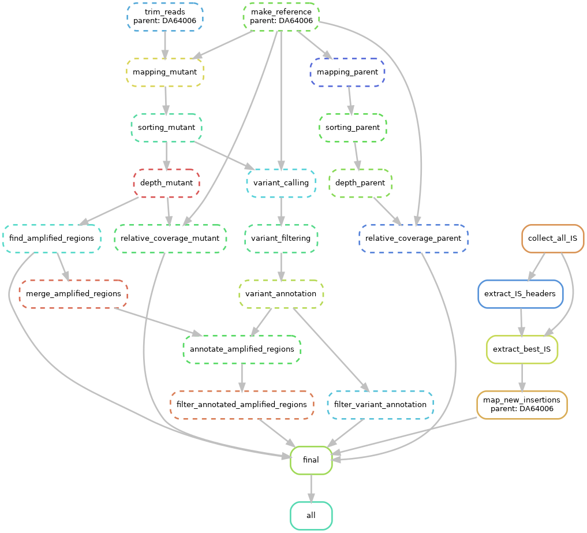

[](https://snakemake.bitbucket.io)   

# Machine learning detection of unstable antibiotic heteroresistance in *E. coli*

This repository contains code and data for the heteroresistance detection project [published](https://www.sciencedirect.com/science/article/pii/S2352396425000623) in eBioMedicine.

The pipelines were created using [Snakemake](https://snakemake.readthedocs.io/en/stable) v7.32.4

Data analysis was performed using *R* v4.4.1 and machine learning was performed using [tidymodels](https://www.tidymodels.org/) v1.2.0.

This project contains 3 pipelines:

- (1) to run hybrid assembly of genomes and annotation of resistance genes, direct repeats and IS elements.

- (2) to run analysis of HR mutants

- (3) to run core-genome based phylogeny

The pipelines have been tested on Ubuntu 22.04.5 with conda v23.1.0 and mamba v1.1.0

**Important notes**

(1) Hybrid assembly script will not work if your system doesn't have *libgsl.so.25* and *libcblas.so.3* (both required by bcftools which is required by medaka=1.6.0).
For some reason, the wrong versions of these libraries are installed by conda when solving the environment. In such case use files in `workflow/libs` - copy or link them to the environment's `lib` directory.

(2) If you choose to run the pipelines in containers, be ready that some environments may not be resolved. Although, everything worked on 'vanilla' Ubuntu 22.04.5. 
Maybe try only conda environments first. If it works, then no need to use containers.

## How to run the assembly-annotation pipeline (1) + ML

1. download the repository using:

```bash
git clone https://github.com/andrewgull/HeteroR
```

Navigate to the `HeteroR` directory (in all following steps, we will assume that you are inside this directory).

3. create a directory for raw reads

```bash
mkdir -p resources/raw/
```

4. download the raw reads (in NCBI's SRA database: PRJNA1165464) to this directory. Naming convention: long reads have `.fastq.gz` extension and paired short reads have `.fq.gz`extension.
By default reads downloaded from SRA have names like "SRR followed by 8 digits", this project assumes theat all the read files are named after the in-house naming scheme which is "DA followed by 6 digits".
To determine how the SRR numbers correspond to DA numbers, refer to the table `configs/da_srr_mapping.csv`.

5. One more piece of data you need is [CARD database](https://card.mcmaster.ca/). You can download the newest version using:

```bash
wget https://card.mcmaster.ca/latest/data
```

and then follow the instructions on the CARD website on how to get the actual database.

OR you can use the version *we used* for this project which is in `localDB.tgz` archive. Just unpack it and make sure it's inside the project's directory, i.e. inside `HeteroR`:

```bash
tar -xf localDB.tgz
```

The corresponding step of the pipleine will find this database and use it for resistance gene identification.

6. install [conda/mamba](https://github.com/conda-forge/miniforge#mambaforge) and [snakemake](https://snakemake.readthedocs.io/en/stable)

7. activate snakemake environment:

```bash
conda activate snakemake
```

8. run the pipeline using this command:

```bash
# substitute $N with a number of threads you want to use
snakemake --snakefile workflow/assembly-annotation.smk --use-conda  --cores $N
```

note: add `--use-singularity` if you want to run the analysis inside a container (check the **Important notes** above!).

After the main pipeline has finished, you can run the three R notebooks (but not necessarily all of them):

1. to generate features table: `notebooks/modelling/features.qmd` (also, a pre-compiled table is available here `notebooks/modelling/data/features_strain.csv`)
2. for exploratory data anlysis: `notebooks/modelling/EDA.qmd` (pre-compiled HTML file is available here `notebooks/modelling/EDA.html.gz`)
3. to run training and validation:`notebooks/modelling/training_and_validation.Rmd` (pre-compiled HTML file is available here `notebooks/modelling/training_and_validation.html.gz`)
4. for comparison and analysis of the models: `notebooks/modelling/models_analysis.Rmd` (pre-compiled HTML file is available here `notebooks/modelling/models_analysis.html.gz`)

To ensure that you use the same versions of R packages as were used in these notebooks, install *renv* package and run `renv::restore()` ([here](https://rstudio.github.io/renv/index.html) you can find *renv* documentation).

## How to run the additional analyses

### Analysis of the HR mutants (2)

1. place mutant read files in `resources/raw/mutants`. Naming convention: `{parent_strain_name}_[1,2].fq.gz`. To determine parental strains of the mutants, refer to the file `configs/parent_mutant_srr_mapping.csv`

2. run the pipeline with the following command:

```bash
# analysis of the HR mutants
# substitute $N with a number of threads you want to use
snakemake --snakefile workflow/mutants.smk --use-conda --use-singularity --cores $N
```

remove `--use-singularity` if you want to use only conda environments.

### Phylogenetic analysis (3)

1. place the genomes (assemblies) of the 31 reference strains in `results/assemblies_joined/`. The names of these strains are provided in `configs/strains_phylogeny.txt`. Each genome should be placed in its own directory named accordig to this list of strains. Each assembly file should be named `assembly.fasta` (the same way as with the 474 collection strains from the pipeline (1)).

2. run the following command:

```bash
# substitute $N with a number of threads you want to use
snakemake --snakefile workflow/phylogeny.smk --use-conda --use-singularity --cores $N
```

remove `--use-singularity` if you want to use only conda environments.

**NB**: to find NCBI accession numbers of the reference strains, refer to file `configs/reference_strains.csv`.

You can change the reference strain names provided in the strain list to whichever suits you better.

## Configuration & Settings

Lists of strain names used in each of the pipelines can be found in `configs/strains_*.txt` files.

Settings of each software tool used can be found in `configs/config_*.yaml` files.

Software versions are specified in yaml files located in `workflow/envs`.

## Raw data availability

The raw sequencing reads used in this project are available from NCBI's SRA under BioProjects PRJNA1165464 (474 parental strains), PRJNA1083935 and PRJNA1160527 (mutants).

## Models and features table

The pre-compiled features table is available in `notebooks/modelling/data/features_strain.csv`

The final models (trained LLR and GBT) are available in `notebooks/modelling/models`.

## Rule graphs

1. The main analysis

2. HR mutants analysis

