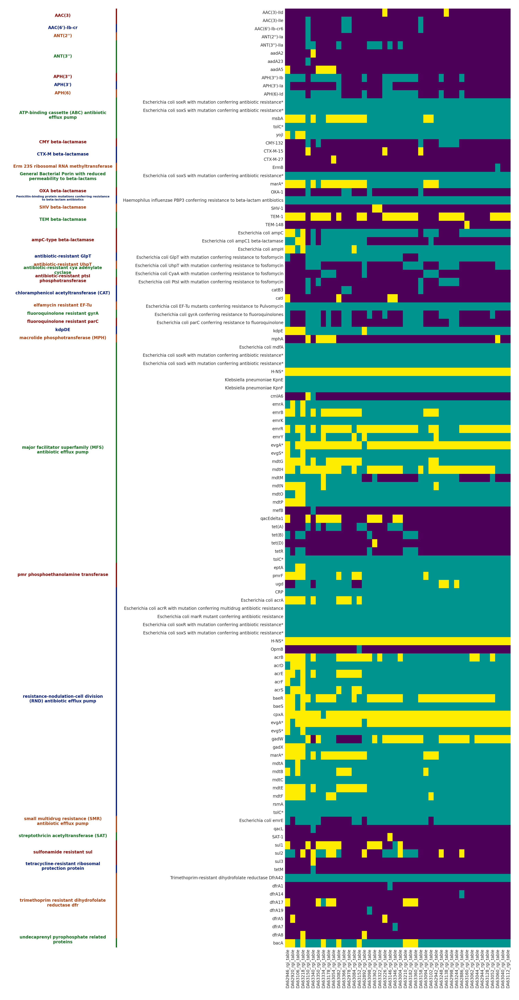

# HeteroR
code for heteroresistance project

Current DAG example:

project structure:

`data_raw/`

`data_filtered/`

`qualcheck_reads/`

`assemblies/`

`qualcheck_assemblies/`

`mapping/`

`plasmids/`

`annotations/`

`resistance_genes/`

`workflow/`
 - `.snakemake`
 - `envs`
 - `scripts`

`strain_list.txt`

`config.yaml`

`snakefile`

workflow:

1. mount ARGOS
2. copy files
3. prepare files
4. get coverage
5. create config
6. load a local instance of CARD db (it must be in the project dir as 'localDB' - `rgi load`)
7. run the pipeline on these files: `snakemake --use-conda --cores 12 --resources mem_mb=12000`
8. run `rgi heatmap -i <dir with jsons>` to get an overview of resistance hits in your strains

The most recent version of RGI heatmap

AMR genes categorised by AMR Gene Family and samples have been clustered hierarchically (see SciPy documentation). 
Yellow represents a perfect hit, teal represents a strict hit, purple represents no hit. 
Genes with asterisks (*) appear multiple times because they belong to more than one AMR Gene Family category in the antibiotic resistance ontology (ARO).