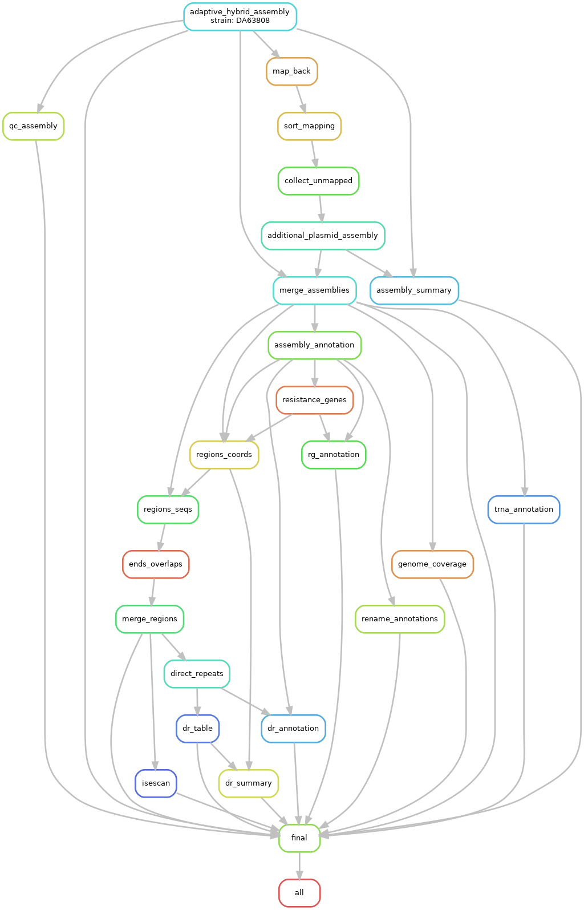
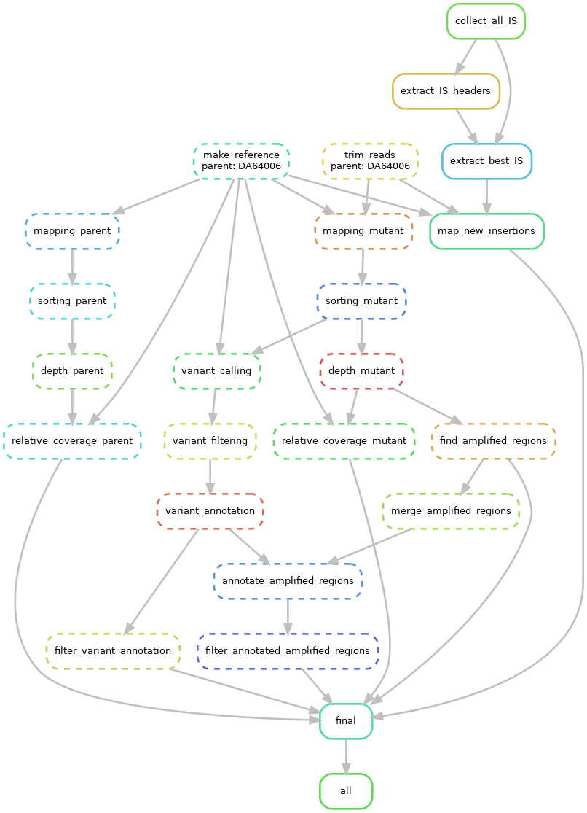

# Machine learning detection of unstable antibiotic heteroresistance in *E. coli*

This repository contains code and certain types data for the project published in %journalname%.

The pipelines were created using [Snakemake](https://snakemake.readthedocs.io/en/stable) v8.23.1

Data analysis was performed using *R* v4.4.1 and machine learning was performed using [tidymodels](https://www.tidymodels.org/) v1.2.0.

## How to run the main analysis

First, ensure that the raw (short and long) reads are placed in `resources/data_raw/{strain}/short/` and `resources/data_raw/{strain}/long/` directories inside the project's directory.

Second, run the main pipeline (genome assembly, anotation of resistance genes, repeats and insertion sequences):

a) with this command to use *only* conda environments:

```bash
# navigate to the project's directory
# substitute $N with a number you want to use
snakemake --snakefile workflow/snakefile.smk --use-conda --cores $N
```

or  

b) with this command to use conda environments inside Apptainer containers:

```bash
# navigate to the project's directory
# substitute $N with a number you want to use
snakemake --snakefile workflow/snakefile.smk --use-conda --use-singularity --cores $N
```

for more details on installation of snakemake and available options (running on computer clusters etc), see the official [Snakemake documentation](https://snakemake.readthedocs.io/en/stable/)

After the main pipeline has finished, you can run the three R notebooks (but not necessarily all of them):

1. to generate features table: `notebooks/modelling/features.qmd` (it is already available in `notebooks/modelling/data/features_strain.csv`)
2. for exploratory data anlysis: `notebooks/modelling/EDA.qmd`
3. to run training and validation:`notebooks/modelling/training_and_validation.Rmd`
4. for comparison and analysis of the models: `notebooks/modelling/models_analysis.Rmd`

To install the same versions of R packages as were used in these notebooks, install *renv* package first and then run `renv::restore()` ([here](https://rstudio.github.io/renv/index.html) you can find *renv* documentation).

## How to run the additional analyses

### Analysis of the HR mutants

```bash
# analysis of the HR mutants
snakemake --snakefile workflow/mutants.smk --use-conda --use-singularity --cores $N
```

### Phylogenetic analysis

```bash
snakemake --snakefile workflow/phylogeny.smk --use-conda --use-singularity --cores $N
```

**NB**: 31 reference strain are required (see the publication for reference numbers).

### Configuration & Settings

Lists of strain names used in each of the pipelines can be found in `configs/strains_*.txt` files.

Settings of each software tool used can be found in `configs/config_*.yaml` files.

## Raw data availability

The raw sequencing reads used in this project are available from NCBI's SRA under BioProjects PRJNA1165464 and PRJNA1083935.

## Models and features table

The pre-compiled features table is available here: `notebooks/modelling/data/features_strain.csv`

The final models (trained LLR and GBT) are available here: `notebooks/modelling/models/llr_final.rds` & `notebooks/modelling/models/gbt_final.rds`

## Rule graphs

1. The main analysis

2. HR mutants analysis

