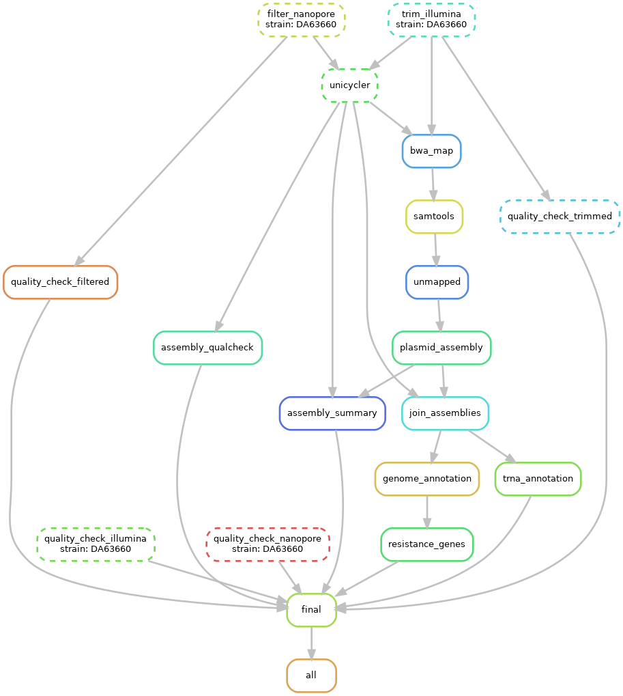

# Sequence based prediciton of Unstable and Gene-amplification Generated Heteroresistance

**Background:** Heteroresistance (HR) is a phenomenon in which a preexisting subpopulation of resistant cells can rapidly replicate in the presence of a given antibiotic, whereas the majority population of susceptible cells is killed. The mechanisms underlying HR are somewhat unclear, although unstable amplification of antibiotic resistance genes resulting in increased gene dosage is responsible for the resistant subpopulation in numerous cases

**Objective:** Predicting heteroresistance from bacterial genome data.

**Input:** 
- Nanopore and Illumina reads;
- "resistance labels"

**Metrics:**

1. Presence of resistance genes (RG)
   - presence of known RG as identified from the CARD database
   - presence of efflux pumps as identified from the CARD database

2. Presence of amplifiable regions
   - For each RG all pairs of direct repeats (DR) flanking the RG. 
     - DR min length = 10 bp, max mismatch = 10%, search range 100 kb. 
     - DR pairs are scored according to their length, their level of identity, and their distance to each other. 
     - These three parameters should reflect the probability that the segment encompassing the RG will be amplified. 

3. Presence of deleterious effects
   - truncated genes
   - broken operons
   - co-expression
   - toxic genes

   - Are any of the DRs inside a gene? Amplification would create truncated proteins, which may have a toxic effect, in particular for essential genes. Interrupted genes will be compared to the TraDIS (19) and the Keio (6) databases to identify essential genes.
Are any of the DRs inside an operon? Amplifications would break the operon and thereby modify the stoichiometry of the proteins produced by the operon. Operons will be identified through the ODB4 database (https://operondb.jp/)
Are any of the genes in the amplified segment known to be co-expressed with a gene outside of the segment? As in the operon case, changes in stoichiometry might be deleterious. Co-expressed genes will be identified using the data collated in StringDB ( https://string-db.org/).
Are any of the genes in the amplified segment know to be toxic if overexpressed? Amplifications would presumably increase the expression of the gene. Toxic genes will be identified using three different databases (EDGE (33), ASKA (22) and PandaTox (https://exploration.weizmann.ac.il/pandatox/1_0/home.html).

## The project structure:

`data_raw/`

`data_filtered/`

`qualcheck_reads/`

`assemblies/`

`qualcheck_assembly/`

`mapping/`

`plasmids/`

`assemblies_joined/`

`annotations/`

`resistance_genes/`

`logs/`

`strain_lists/`

`test_dir/`

`tools/`

`localDB/`

`busco_downloads/`

`coverage/`

`final/`

`dags/`

`card_database/`

`notebooks/` - these are copies of actual notebooks that I keep on GoogleDrive. Hope these copies will be updated regularly

`workflow/`
 - `snakefile`
 - `envs`
 - `scripts`

`config.yaml`

## Workflow:

1. mount ARGOS
2. copy files
3. prepare files
4. get coverage
5. create config
6. load a local instance of CARD db (it must be in the project dir as 'localDB' - `rgi load`)
7. run the pipeline on these files: `snakemake --use-conda --cores 12 --resources mem_mb=12000`
8. run the following command to get an overview of resistance hits in your strains
   ```
   cd resistance genes; 
   for D in DA*; do ln -s "/home/andrei/Data/HeteroR/resistance_genes/"$D"/rgi_table.json" "/home/andrei/Data/HeteroR/resistance_genes/linked/"$D"_rgi_table.json"; done && 
   rgi heatmap -i linked -o heatmap -cat gene_family -clus samples
   ```

## DAG example

the most recent version



## Heatmap

the most recent version

The most recent version of RGI heatmap


AMR genes categorised by AMR Gene Family and samples have been clustered hierarchically (see SciPy documentation). 
Yellow represents a perfect hit, teal represents a strict hit, purple represents no hit. 
Genes with asterisks (*) appear multiple times because they belong to more than one AMR Gene Family category in the antibiotic resistance ontology (ARO).