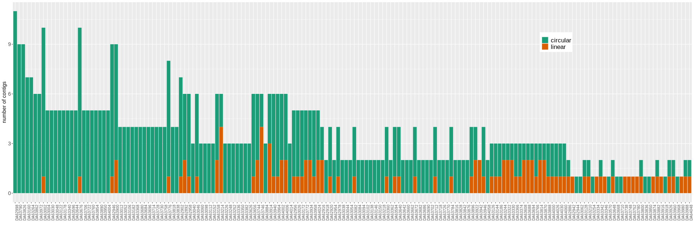

# Introduction

Having analysed assemblies' summaries I found out that a lot of them (n=89) are incomplete, i.e. not circularised by Unicycler.
One possible reason can be that they were trimmed to harshly by *filtlong*.



I have a table with incomplete assemblies
```{r}
library(dplyr)

# just in case
setwd("/home/andrei/Data/HeteroR")
my_path <- "/home/andrei/Data/HeteroR/results/assemblies_joined"

summary_files <- dir(path=my_path,  pattern = "summary.tsv", recursive=TRUE)
summary_table <- lapply(summary_files, function(x){read.delim(paste0("results/assemblies_joined/", x), stringsAsFactors = TRUE)})

summary_table <- bind_rows(summary_table)
# replace commas in Length, N50 and Longest component
summary_table$Length <- as.integer(gsub(",", "", summary_table$Length, fixed=TRUE))
summary_table$N50 <- as.integer(gsub(",", "", summary_table$N50, fixed=TRUE))
summary_table$Longest_component <- as.integer(gsub(",", "", summary_table$Longest_component, fixed=TRUE))
summary_table
```
```{r, eval=FALSE}
print("here I'd write the incomplete assemblies table")
#write.delim(summary_table %>% filter(Status == "incomplete"), "/home/andrei/Data/HeteroR/incomplete_assemblies.tsv", sep="\t", quote=F)
```
```{r}
incomplete_assemblies <- read.delim("/home/andrei/Data/HeteroR/incomplete_assemblies.tsv")
incomplete_assemblies
```

Then I ran *coverage.py* on both raw and filtered Nanopore reads in hope to capture the difference...

```
python  workflow/scripts/coverage.py resources/strain_lists/incomplete_assemblies_strains_80.txt 5131220 results/coverage/incomplete_assemblies_strains_80_coverage.tsv raw
python  workflow/scripts/coverage.py resources/strain_lists/incomplete_assemblies_strains_80.txt 5131220 results/coverage/incomplete_assemblies_strains_80_coverage_filtered.tsv filtered
```

Let's look at results

```{r}
coverage_raw <- read.delim("/home/andrei/Data/HeteroR/results/coverage/incomplete_assemblies_strains_80_coverage.tsv")
coverage_raw$strain <- sapply(coverage_raw$file, function(x){strsplit(x, "/")[[1]][3]})
coverage_raw$filtered <- "no"

coverage_filtered <- read.delim("/home/andrei/Data/HeteroR/results/coverage/incomplete_assemblies_strains_80_coverage_filtered.tsv")
coverage_filtered$strain <- sapply(coverage_filtered$file, function(x){strsplit(x, "/")[[1]][3]})
coverage_filtered <- select(coverage_filtered, -c(file, format, type))
coverage_filtered$filtered <- "yes"

coverage_joined <- bind_rows(coverage_raw, coverage_filtered)
coverage_joined <- select(coverage_joined, -c(file, format, type))
coverage_joined
```

# Plots

## Number of sequences

```{r}
library(ggplot2)

ggplot(coverage_joined, aes(strain, num_seqs))+
         geom_col(aes(fill=filtered), position="dodge")+
        theme(axis.text.x = element_text(size = 7, angle = 90))+
        ggtitle("Number of reads")+
        ylab("")+
        xlab("")

#+coord_trans(y="sqrt")
```

## Coverage

```{r}
ggplot(coverage_joined, aes(strain, coverage))+
         geom_col(aes(fill=filtered), position="dodge")+
        theme(axis.text.x = element_text(size = 7, angle = 90))+
        ggtitle("Coverage")+
        ylab("")+
        xlab("")

```

## Coverage of complete strains

Are changes there as big as in incomplete ones?

```{r}
coverage_all_filtered <- read.delim("/home/andrei/Data/HeteroR/results/coverage/nanopore_coverage1-216.tsv")
coverage_all_filtered$filtered <- "yes"
coverage_all_raw <- read.delim("/home/andrei/Data/HeteroR/results/coverage/nanopore_coverage1-216_raw.tsv")
coverage_all_raw$filtered <- "no"

# add strain
coverage_all_raw$Strain <- sapply(coverage_all_raw$file, function(x){substr(tail(strsplit(x, "/")[[1]], 1), 1, 7)})
coverage_all_filtered$Strain <- sapply(coverage_all_filtered$file, function(x){substr(tail(strsplit(x, "/")[[1]], 1), 1, 7)})

# add completeness info
summary_chrom <- summary_table %>% filter(Type=="Chromosome") %>% select(Strain, Status)
coverage_all_raw <- left_join(summary_chrom, coverage_all_raw, by="Strain") %>% filter(!is.na(Status))
coverage_all_filtered <- left_join(summary_chrom, coverage_all_filtered, by="Strain") %>% filter(!is.na(Status))

coverage_all_joined <- bind_rows(coverage_all_filtered, coverage_all_raw)
coverage_all_joined
```

```{r}
ggplot(coverage_all_joined, aes(Strain, coverage))+
         geom_col(aes(fill=filtered), position="dodge")+
        theme(axis.text.x = element_text(size = 7, angle = 90))+
        ggtitle("Coverage")+
        ylab("")+
        xlab("")+
        facet_grid(rows=vars(Status))
```


For the thorough coverage comparison see below

## Summary length

```{r}
ggplot(coverage_joined, aes(strain, sum_len))+
         geom_col(aes(fill=filtered), position="dodge")+
        theme(axis.text.x = element_text(size = 7, angle = 90))+
        ggtitle("Total read length")+
        ylab("")+
        xlab("")
```

## Minimum length

```{r}
ggplot(coverage_joined, aes(strain, min_len))+
         geom_col(aes(fill=filtered), position="dodge")+
        theme(axis.text.x = element_text(size = 7, angle = 90))+
        ggtitle("Minimum read length")+
        ylab("")+
        xlab("")
```

## Average length

```{r}
ggplot(coverage_joined, aes(strain, avg_len))+
         geom_col(aes(fill=filtered), position="dodge")+
        theme(axis.text.x = element_text(size = 7, angle = 90))+
        ggtitle("Average read length")+
        ylab("")+
        xlab("")
```

## Maximum length

```{r}
ggplot(coverage_joined, aes(strain, max_len))+
         geom_col(aes(fill=filtered), position="dodge")+
        theme(axis.text.x = element_text(size = 7, angle = 90))+
        ggtitle("Maximum read length")+
        ylab("")+
        xlab("")
```
Max length didn't suffer much, while minimum and average lengths actually improved

filtlong command looks like this:
```
filtlong --min_length 5000 --length_weight 1 --keep_percent 20 --target_bases 260000000 {input} 2> {log} | pigz -c -p {threads} > {output}
```

# Coverage as predictor of an assembly's circularization

I need data on coverage

## Before filtering

Not used in the following analysis.
When it was used, the coverage coefficient and R-squared were a bit lower

```{r, eval=FALSE}
coverage_path <- "/home/andrei/Data/HeteroR/results/coverage/"
coverage_files <- dir(coverage_path, pattern="nanopore_coverage[0-9,-]*.tsv")

coverage_table <- lapply(coverage_files, function(x){read.delim(paste0(coverage_path, x), stringsAsFactors = FALSE)})
coverage_table <- bind_rows(coverage_table)
coverage_table <- filter(coverage_table, !is.na(coverage))
coverage_table$Strain <- sapply(coverage_table$file, function(x){substr(tail(strsplit(x, "/")[[1]], 1), 1, 7)})
coverage_table
```

## After filtering (used for actual assembling)

That's what's used in the following analysis

```{r}
coverage_table <- read.delim("/home/andrei/Data/HeteroR/results/coverage/nanopore_coverage1-216.tsv")
coverage_table <- filter(coverage_table, !is.na(coverage))
coverage_table$Strain <- sapply(coverage_table$file, function(x){substr(tail(strsplit(x, "/")[[1]], 1), 1, 7)})
coverage_table
```


Add completeness information from the summaries
```{r}
summary_chrom <- summary_table %>% filter(Type=="Chromosome")
summary_coverage <- left_join(coverage_table, summary_chrom, by="Strain") %>% filter(!is.na(Status))
summary_coverage
```

## Plot potential predictors

```{r}
library(ggplot2)
library(cowplot)

cov_plot <- ggplot(summary_coverage, aes(Status, coverage))+geom_boxplot()+geom_violin(alpha=0.0)+xlab("")
maxlen_plot <- ggplot(summary_coverage, aes(Status, max_len))+geom_boxplot()+geom_violin(alpha=0.0)+xlab("")
avglen_plot <- ggplot(summary_coverage, aes(Status, avg_len))+geom_boxplot()+geom_violin(alpha=0.0)+xlab("")
sumlen_plot <- ggplot(summary_coverage, aes(Status, sum_len))+geom_boxplot()+geom_violin(alpha=0.0)+xlab("")
numseq_plot <- ggplot(summary_coverage, aes(Status, num_seqs))+geom_boxplot()+geom_violin(alpha=0.0)+xlab("")
plot_grid(cov_plot, maxlen_plot, avglen_plot, sumlen_plot, numseq_plot, nrow=2)
```

```{r}
pairs(summary_coverage %>% select(coverage, max_len, avg_len, sum_len, num_seqs))
```

## Regression analysis

### Only coverage

#### Model

```{r}
fit_coverage <- glm(Status ~ coverage, data=summary_coverage, family = "binomial")
summary(fit_coverage)
```

Deviance decreases a lot which is very good (from 220 to 143 after inclusion of just a single parameter).
Effect of coverage on incompleteness is negative.

#### R-squared

```{r}
rsquared <- function(created_model) {
  dev <- created_model$deviance
  null_dev <- created_model$null.deviance
  model_n <- length(created_model$fitted.values)
  R_l <- 1 - dev / null_dev
  R_cs <- 1 - exp(-(null_dev - dev) / model_n)
  R_n <- R_cs / (1 - exp(-(null_dev / model_n)))
  cat("Pseudo R-squared for logistic regression model\n\n")
  cat("Hosmer and Lemeshow R-squared\t", round(R_l, 3), "\n")
  cat("Cox and Snell R-squared\t\t\t", round(R_cs, 3), "\n")
  cat("Nagelkerke R-squared\t\t\t\t", round(R_n, 3), "\n")
}

rsquared(fit_coverage)
```

#### Kruskal-Wallis test

```{r}
kw.coverage <- kruskal.test(coverage ~ Status, data=summary_coverage)
kw.coverage
```

#### Odds ratio
Prob. success / prob. failure
```{r}
exp(coef(fit_coverage))
```

Increasing "coverage" by a unit gives ~25% decrease in the odds (simply put - chances) that an assembly will be incomplete (remember that success is "incomplete" here).

#### Choosing a probability cut-off

```{r}
for_pred <- select(summary_coverage, c(Status, coverage))
for_pred$prob <- predict(object = fit_coverage, type = "response")
for_pred
```

Here "incomplete" is a success (the higher is the coverage, the lower is the probability of success)

```{r, message=FALSE}
library(ROCR)
library(cvAUC)

pred.fit <- prediction(for_pred$prob, for_pred$Status)
perf.fit <- performance(pred.fit ,"tpr","fpr")
plot(perf.fit, colorize=T , xlab='False positive results', ylab='True positive results')

```

```{r}
cvauc <- AUC(for_pred$prob, for_pred$Status)
# the following line also calculate sAUC but ith SE and CI
auc.cis <- ci.cvAUC(for_pred$prob, for_pred$Status, confidence = .95)
auc.cis
```

AUC is quite good

```{r}
perf.spec  <- performance(pred.fit, x.measure = "cutoff", measure = "spec")
perf.sens  <- performance(pred.fit, x.measure = "cutoff", measure = "sens")
perf.acc  <- performance(pred.fit, x.measure = "cutoff", measure = "acc")

plot(perf.spec, col = "red", lwd =2, xlab='probability', ylab='')
plot(add=T, perf.sens , col = "steelblue", lwd =2)
plot(add=T, perf.acc, lwd =2)

legend(x = 0.6,y = 0.3, c("spec", "sens", "acc"),
       lty = 1, col =c('red', 'steelblue', 'black'), bty = 'n', cex = 1, lwd = 2)
# determine x coordinate manually!
abline(v= 0.4, lwd = 2, lty=6)
abline(v=0.747, lwd=1, lty=3)

```

specificity => 1 -> starting from prob=0.78 **all you find** is "incomplete"
sensitivity => 1 -> you find **every "incomplete"**


To illustrate this:

```{r}
for_pred %>% filter(prob >= 0.0 & Status=="incomplete") %>% nrow()
```

Same number here

```{r}
for_pred %>% filter(Status=="incomplete") %>% nrow()
```
no complete found here:


```{r}
for_pred %>% filter(prob >= 0.78 & Status=="complete")
```

#### Cut-off table

```{r}
cutoff_table <- data.frame("probability"=perf.spec@x.values[[1]], "specificity"=perf.spec@y.values[[1]])
cutoff_table
```

So, even with probability cut-off = 0.70 I have specificity 0.99
Maybe spec=0.95 if fine, then prob. cut-off should be 0.63 (or 0.70 for better)

```{r}
for_pred %>% arrange(-prob) %>% filter(prob > 0.63 & Status=="complete") %>% nrow()
```

```{r}
for_pred %>% arrange(-prob) %>% filter(prob > 0.70 & Status=="complete") %>% nrow()
```

#### Formula

*glm()* outputs logits which being exponentiated give you odds ratios. OR is Prob.success/Prob.failure

So there is an easy way to get probability out of OR and logits.

Based on this probability I will decide to trim or not to trim

```{r}
logit2prob <- function(logit){
  odds <- exp(logit)
  prob <- odds / (1 + odds)
  return(prob)
}

# if coverage = 5.10721
# probability will be
coverage_example <- 5.10721
logit2prob(2.2401998 - 0.2889426*coverage_example)
# or the same
cf <- coef(fit_coverage)
names(cf) <- NULL
prob_example <- logit2prob(coef(cf)[1] + coef(cf)[2]*coverage_example)
prob_example
```
Which is exactly what you have on the first line of **for_pred**

Thr formula looks like this:

$P(incomplete) = exp(2.2401998 - 0.2889426*coverage)/1+(exp(2.2401998 - 0.2889426*coverage))$

You can put it in a function in the pipeline

### Coverage + the rest (except sum_len & num_seqs)

```{r}
fit_everything <- glm(Status ~ coverage + avg_len + max_len , data=summary_coverage, family = "binomial")
summary(fit_everything)
```

```{r}
rsquared(fit_everything)
```

```{r}
kruskal.test(num_seqs ~ Status,  data=summary_coverage)
```

# Conclusion

Coverage is the main predictors of the completeness (among the data that we have)
number of sequences and summary length are correlated

Balanced probability cut-off for the Status ~ coverage model is 0.4

What is more important: specificity or sensitivity?
Say, a read data set has coverage X.
Based on that coverage value, I want to know whether to trim the reads or not.
If my model predicts that this data set will be an incomplete assembly after trimming, I do not trim it.
If my model predicts that this data set will be a complete assembly after trimming, I trim it.
More important is to identify "incomplete" (and not trim it), rather than get some false positive "complete" ones and not trim them too,
because I know that if I don't trim reads, they may break Unicycler.

And this is applicable to current trimming rules only!


